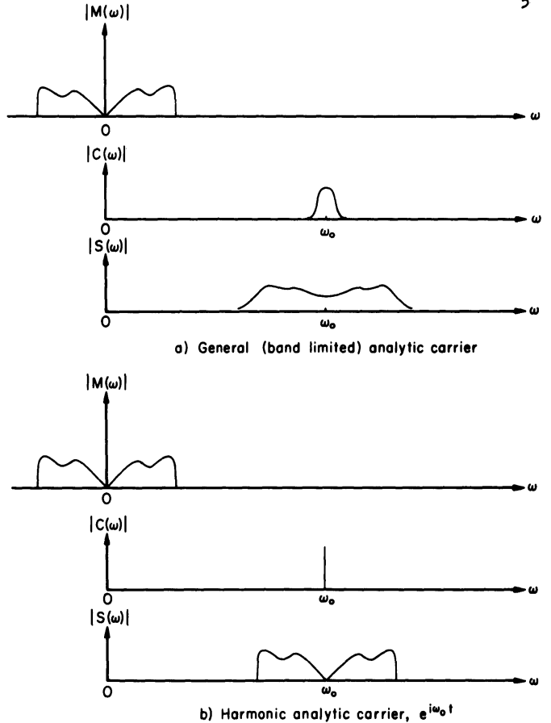

# The Analytic Signal Representation of Modulated Waveforms
## Edward Bedrosian (1962)

> Transcribed from pages 10–26 of the original RAND memorandum.  
> Pages corresponding to original PDF pages 14 and 22 contain diagrams/plots and are inserted as image placeholders.

---

# I. INTRODUCTION

Recent studies of compatible single sideband (SSB) modulation systems have stimulated interest in the theoretical aspects of simultaneous amplitude and phase modulation. These studies are notable for at least two reasons which are not connected with the specific application.

First, they underscore the fact that although amplitude and phase modulation are distinct techniques, they have an intimate connection.

Second, theoretical studies invariably introduce the Hilbert transform sooner or later and become, in fact, applications of the analytic signal.

Other studies dealing with various types of signal and noise waveforms further attest to the growing utility of the analytic signal representation as a theoretical device.

This paper considers the application of the analytic signal to Baghdady’s representation of analog modulation in order to obtain a more general formulation which embraces known types of analog modulation and in which signals having one-sided spectra are implicit.

---

# II. THE ANALYTIC SIGNAL

Basically, the analytic signal is a complex function of a real variable whose real and imaginary parts are a Hilbert pair. In practice, the actual waveform under consideration is identified with either the real or the imaginary part of the analytic signal; the analytic signal is then simply substituted for the actual signal for the purpose of analysis.

Frequently the result is a more convenient and compact notation which can be used in convolution integrals or in conjunction with transfer functions in the same fashion as the real signal and which, in addition, has several interesting and useful properties:

1. The Fourier transform of the analytic signal vanishes for negative frequencies.
2. The magnitude of the analytic signal is the envelope of the actual waveform.
3. The phase of the analytic signal is equal to the phase of the actual waveform.

It is clear from the foregoing that the analytic signal is simply a formalized version of the “rotating vector” or “phasor” that is frequently used in circuit analysis and studies of communication systems.

The theoretical justification of this representation is gratifying because it brings to light some of the otherwise unsuspected properties listed above as well as eliminating the need for its intuitive introduction.

---

# III. THE MODULATED SIGNAL

While the actual processes employed in generating an analog-modulated signal may differ considerably for various types of modulation, the resulting signal appears representable as the product of two time functions:

$$
S(t) = c(t)\,m(f(t))
$$

where $c$ is a function representing the carrier and $m$ is the modulation functional representing an operation on the modulating signal $f$.

The form of Eq. (1) has the advantage of mathematically disassociating the operation of providing a carrier from that of characterizing the actual modulation technique.

## The Carrier Function

The purpose of the carrier function in Eq. (1) is to transfer the intelligence spectrum to a frequency region which is more suitable for propagation.

The effect on the resulting spectrum is seen from the Fourier transform of the product in Eq. (1):

$$
S(\omega)=\frac{1}{2\pi}\int_{-\infty}^{\infty} C(\mu)M(\omega-\mu)\,d\mu
$$

If the carrier is a narrow-band waveform as might be employed for noise modulation, then the convolution expressed in Eq. (2) results in a spreading of the signal band as well as its translation to the vicinity of the carrier frequency.

If the carrier is a pure sinusoid, then a simple frequency translation is effected and Eq. (2) becomes

$$
S(\omega)=M(\omega-\omega_0)+M(\omega+\omega_0)
$$

If the carrier is written as an analytic signal whose spectrum therefore exists only for positive frequencies, then the frequency transfer is only toward the positive frequencies.

---

## Figure 1 (Original PDF page 14)

*Caption:* Spectral translations due to introduction of analytic carrier.

---

## The Modulation Function

Usable modulation functions must be limited, of course, to those which yield modulated signals amenable to subsequent demodulation.

The techniques currently available are:

- coherent (amplitude) detection,
- phase or frequency detection,
- envelope detection.

Thus, the modulation function must cause the modulating signal to appear (though not necessarily linearly) in either the amplitude, phase/frequency, or envelope of the modulated signal.

The linear and exponential functionals are unique in their ability to produce just these effects and are therefore the only ones considered here.

As might be suspected, the linear functional corresponds to amplitude modulation. The exponential functional, however, corresponds not only to the familiar phase modulation but also to the emergent technique of simultaneous amplitude and phase modulation which may be better characterized as envelope modulation.

If the modulation function is written for the analytic as well as the purely real modulating signals, then both the SSB and double-sideband (DSB) forms of modulated signal appear.

No generic differentiation need be made between phase and frequency modulation since they differ only by a linear operation (differentiation or integration) on the modulating signal.

---

# IV. HARMONIC-CARRIER SYSTEMS

The modulated signals resulting from the foregoing modulation functions are best illustrated by using the harmonic analytic carrier:

$$
e^{i\omega_0 t}
$$

For each modulation function $m(t)$ a complex modulated signal $s(t)$ results.

When analytic, both its real and imaginary parts are valid representations of the actual modulated signal, and its magnitude gives the envelope.

The modulating signal is denoted by $f(t)$ and its Hilbert transform by $\hat f(t)$.

---

# Linear (Amplitude) Modulation

## Double Sideband

$$
m(t)=f(t)
$$

$$
s(t)=f(t)\cos\omega_0 t+i f(t)\sin\omega_0 t
$$

$$
|s(t)|=f(t), \qquad \omega_0 \gg \omega_{\max}
$$

The representation of a conventional amplitude-modulated signal is immediately apparent.

The carrier is suppressed in this representation, but the distinction is trivial since it is easily inserted by adding a constant to $m(t)$.

## Single Sideband

$$
m(t)=f(t)+i\hat f(t)
$$

$$
s(t)=\left[f(t)\cos\omega_0 t-\hat f(t)\sin\omega_0 t\right]
+i\left[f(t)\sin\omega_0 t+\hat f(t)\cos\omega_0 t\right]
$$

$$
|s(t)|=\sqrt{f^2(t)+\hat f^2(t)}, \qquad \omega_0>0
$$

That Eq. (5) represents a SSB amplitude-modulated signal is easily shown by noting that $\cos \omega t$ and $\sin \omega t$ are a Hilbert pair.

Thus,

$$
s(t)=\sum_{n=0}^{\infty} c_n e^{i[(\omega_n+\omega_0)t+\phi_n]}
$$

where the simple translation of all frequency components by an amount $\omega_0$ is apparent.

---

# Exponential (Phase) Modulation

## Double Sideband

$$
m(t)=e^{if(t)}
$$

$$
s(t)=\cos[\omega_0 t+f(t)] + i\sin[\omega_0 t+f(t)]
$$

$$
|s(t)|=1, \qquad \omega_0 \gg \omega_{\max}
$$

The conventional representation of phase modulation is apparent in Eq. (6).

Even if the modulating signal $f(t)$ is band-limited, the exponential operation used in generating $m(t)$ assures that it will have a spectrum of infinite extent in both positive and negative directions.

## Single Sideband

$$
m(t)=e^{i[f(t)+i\hat f(t)]}
$$

$$
s(t)=e^{-\hat f(t)}\cos[\omega_0 t+f(t)]
+i e^{-\hat f(t)}\sin[\omega_0 t+f(t)]
$$

$$
|s(t)|=e^{-\hat f(t)}, \qquad \omega_0>0
$$

The modulated signal given by Eq. (7) appears to be novel.

Since the modulation function is now analytic, it contains no negative frequencies. Thus, $s(t)$ is analytic for all values of $\omega_0>0$.

By analogy with Eq. (5), the modulated signal given by Eq. (7) represents a SSB version of phase modulation since it contains no frequency components below $\omega_0$.

The instantaneous frequency is

$$
\omega_{\text{inst}} = \frac{d\phi}{dt} = \omega_0 + \dot f(t)
$$

To demonstrate the effect on the sideband structure, consider frequency modulation by the single sinusoid

$$
\dot f(t)=\Omega \cos \omega t
$$

where $\Omega$ is the peak frequency deviation.

The phase function and its Hilbert transform become

$$
f(t)=\frac{\Omega}{\omega}\sin \omega t
$$

$$
\hat f(t)=-\frac{\Omega}{\omega}\cos \omega t
$$

where $\Omega/\omega$ is the deviation ratio or modulation index.

The modulation function in Eq. (7) becomes

$$
m(t)=\exp\left[\frac{\Omega}{\omega}e^{i\omega t}\right]
=\sum_{k=0}^{\infty}\frac{1}{k!}\left(\frac{\Omega}{\omega}\right)^k e^{ik\omega t}
$$

yielding the analytic modulated signal

$$
s(t)=\sum_{k=0}^{\infty}\frac{1}{k!}\left(\frac{\Omega}{\omega}\right)^k e^{i(\omega_0+k\omega)t}
$$

The actual modulated signal may be taken as the real part:

$$
\sum_{k=0}^{\infty}\frac{1}{k!}\left(\frac{\Omega}{\omega}\right)^k \cos(\omega_0+k\omega)t
$$

from which the one-sided nature of the spectrum is clear.

A conventional frequency-modulated signal using the same modulating signal has the familiar expansion

$$
\cos[\omega_0 t+f(t)] = \sum_{k=-\infty}^{\infty} J_k\left(\frac{\Omega}{\omega}\right)\cos(\omega_0+k\omega)t
$$

---

## Figure 2 (Original PDF page 22)

*Caption:* Magnitudes of spectral components for conventional and SSB forms of FM with sinusoidal modulation.

---

The line spectra of Eqs. (8) and (9) are plotted in Fig. 2 for several deviation ratios.

Generally speaking, the cancellation of the lower sideband is accompanied by an extension of the upper sideband. Nevertheless, the width of the one-sided spectra appears reduced by roughly one-third.

The one-sided signal can be generated from a conventional phase-modulated signal by forming the Hilbert transform and amplitude modulating with the exponential.

---

# Exponential (Envelope) Modulation

## Double Sideband

$$
m(t)=e^{g(t)}, \qquad g(t)=a\log f(t), \qquad f(t)>0
$$

$$
s(t)=f^a(t)\cos\omega_0 t + i f^a(t)\sin\omega_0 t
$$

$$
|s(t)|=f^a(t), \qquad \omega_0 \gg \omega_{\max}
$$

The intermediate function $g(t)$ is introduced in order to produce the desired modulated effects.

## Single Sideband

$$
m(t)=e^{g(t)+i\hat g(t)}, \qquad g(t)=a\log f(t), \qquad f(t)>0
$$

$$
s(t)=f^a(t)\cos[\omega_0 t+a\log f(t)]
+i f^a(t)\sin[\omega_0 t+a\log f(t)]
$$

$$
|s(t)|=f^a(t), \qquad \omega_0>0
$$

The SSB version given by Eq. (11) is related to Eq. (7), from which it can be derived by considering the logarithm of the modulating signal.

The exponent $a$ is important because of the relationship which the choice of its value as either $1$ or $1/2$ bears on the question of compatible SSB modulation.

Powers considers the case $a=1/2$ so that the modulating signal is contained in the square of the envelope, thus requiring a square-law envelope detector for distortionless reproduction.

Lyannoy also considers $a=1$ and points out that this modulated signal occupies a bandwidth just twice the maximum modulating frequency and that it is compatible with a linear envelope detector.

Naturally, there would be no advantage to a compatible SSB system which has the same spectral width as a conventional DSB system, but Lyannoy adds that the bandwidth can be halved in practice by suitable filtering because of the characteristics of speech.

Kahn makes virtually identical observations with regard to his Compatible Single Sideband (CSSB) system.

---

# V. CONCLUSION

It has been shown that analog-modulated signals are representable in general as the product of a carrier function and a modulation function.

When an analytic signal is chosen for the carrier, its effect spectrally becomes one of translating the signal spectrum to the vicinity of the carrier frequency.

The useful forms of the modulation function are the linear and exponential functionals from which three classes of modulated signals can be derived:

- amplitude modulation,
- phase modulation,
- envelope modulation.

Within these classes, the use of the purely real or analytic signal forms of the modulating signal leads naturally to the DSB and SSB spectral forms of the modulated signal.

In addition, a new form of modulation which may be called SSB FM is revealed.

It can be derived from a conventional phase-modulated signal by an additional amplitude modulation using the exponential function of the modulating signal’s Hilbert transform.

The resulting modulated signal will have a one-sided spectrum about the carrier frequency and be compatible with existing FM receivers.

The advantage is a decrease in signal bandwidth; the disadvantage is the loss of a constant transmitter output level.

From a practical viewpoint, this form of FM may find little acceptance in wide-band systems because of the unfavorable peak-to-average power ratio required of the transmitter.

On the other hand, some public-use bands are crowded and users are therefore disposed toward modulation techniques which make more efficient use of the available spectrum.

A compatible narrow-band SSB FM system of the type described here may prove useful in such applications by narrowing the signal bandwidth for a given modulation index without sacrificing the improvement or the immunity to impulse noise associated with FM.

Observation of the comparable form of envelope modulation commends Powers’ suggestion of the application of the non-compatible square-law type of envelope modulation as a means of SSB data transmission.

Conventional SSB is adequate for speech or music because of the tolerance of the human ear for phase or frequency errors in reproduction.

However, data waveforms must be reproduced without such errors, so exact carrier re-insertion is required.

The fact that the modulating signal is contained in the envelope of Eq. (9) indicates that square-law envelope detection should result in distortionless reception, thus obviating carrier re-insertion without sacrificing spectral economy.

